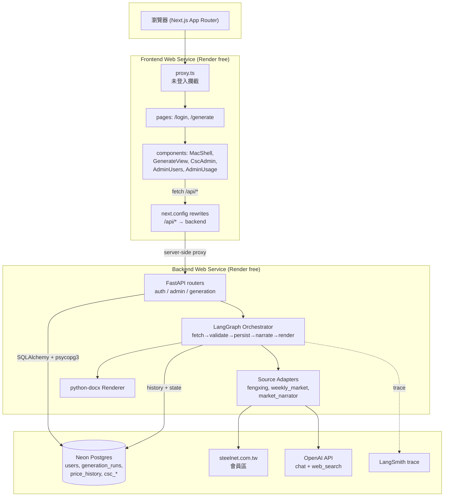
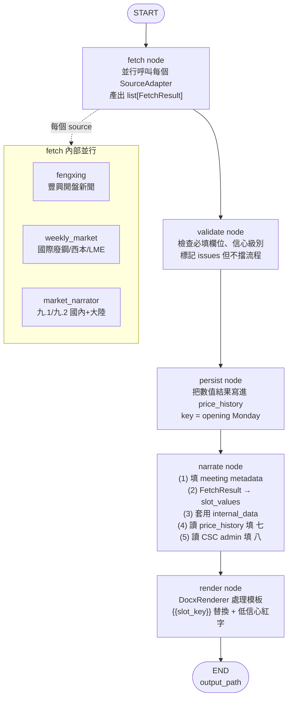
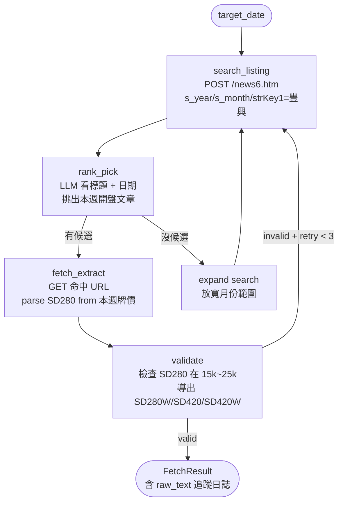
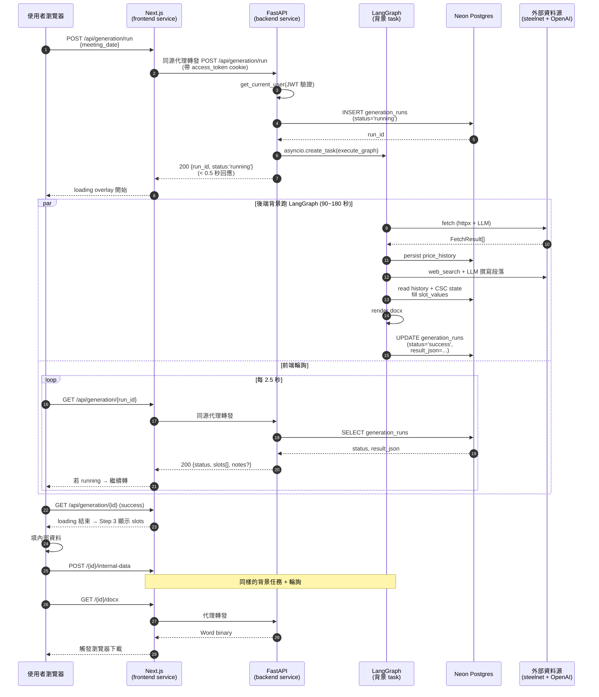
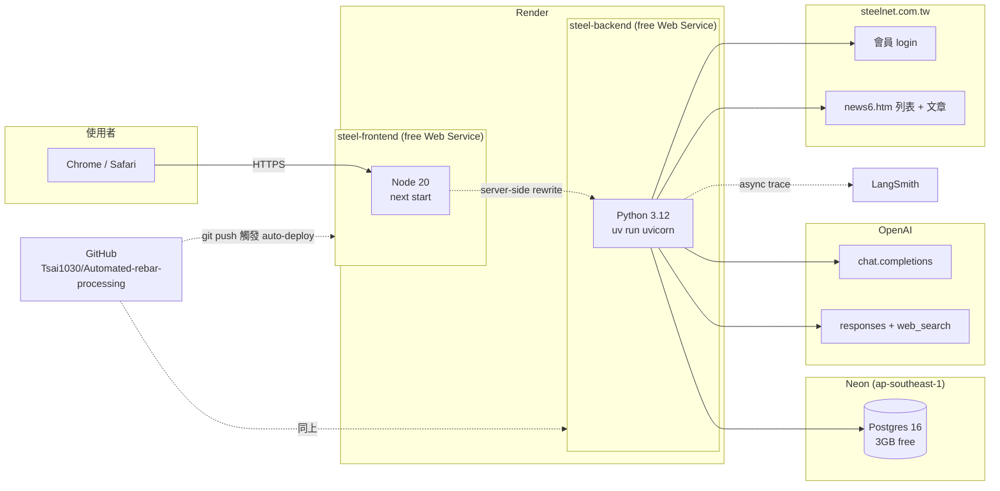

# SYSTEM.md — 鋼筋會議記錄自動填盤系統 詳細設計

> README.md 是這個系統的「目錄頁」，給第一次看到 repo 的人；本檔是「結構藍圖」，給要動程式碼或追問題的人。每一個 module、每一個 LangGraph node、每一段資料流，都列出來並解釋為什麼這樣設計。

---

## 目錄

1. [系統分層](#1-系統分層)
2. [LangGraph 工作流（mermaid）](#2-langgraph-工作流mermaid)
3. [豐興抓取子流程（mermaid）](#3-豐興抓取子流程mermaid)
4. [Request lifecycle（從點按鈕到拿到 Word）](#4-request-lifecycle從點按鈕到拿到-word)
5. [雲端部署拓樸（mermaid）](#5-雲端部署拓樸mermaid)
6. [後端檔案逐一說明](#6-後端檔案逐一說明)
7. [前端檔案逐一說明](#7-前端檔案逐一說明)
8. [腳本逐一說明](#8-腳本逐一說明)
9. [資料模型細節](#9-資料模型細節)
10. [Slot schema 設計細節](#10-slot-schema-設計細節)
11. [認證流程](#11-認證流程)
12. [關鍵設計決策](#12-關鍵設計決策)

---

## 1. 系統分層



---

## 2. LangGraph 工作流（mermaid）

主流程定義在 [`backend/src/steel_backend/core/orchestrator.py`](backend/src/steel_backend/core/orchestrator.py)，由 `build_graph()` 編譯：



**State 物件**（[`graph_state.py`](backend/src/steel_backend/core/graph_state.py)）：

```python
class GenerationState(TypedDict, total=False):
    # Inputs
    run_id: int
    meeting_date: date
    fengxing_open_date: date
    started_by: str
    internal_data: dict[str, str]

    # Phase outputs
    fetched: list[FetchResult]
    validated: list[FetchResult]
    issues: list[ValidationIssue]
    slot_values: dict[str, str]     # 給 docx 模板替換用
    confidence: dict[str, str]      # 'high' | 'medium' | 'low'
    output_path: str | None

    # 自我修正用（Stage 2 預留）
    retry_count: int
    max_retries: int

    messages: Annotated[list, add_messages]
```

> 為什麼 persist 在 narrate 之前？  
> 想要原子化記錄：就算 narrate 失敗，我們仍有當週爬到的原始數字寫進 history，下次跑就會發現。先 narrate 再 persist 會在錯誤時遺失資料。

---

## 3. 豐興抓取子流程（mermaid）

`fengxing` adapter 內部其實也是一個 LangGraph，定義在 [`fengxing_finder.py`](backend/src/steel_backend/sources/fengxing_finder.py)。為什麼用 agent 而不是寫死？因為每週豐興新聞標題不一樣（「豐興本週開盤」「豐興今(11)日上午開出週盤」「豐興今日開出 5 月第一盤」…），同一天甚至有多篇豐興新聞，得讓 LLM 判斷哪一篇是「週盤開盤」那一篇。



衍生規則（使用者規定）：

| 鋼種 | 計算 |
|---|---|
| `SD280W` | `SD280 + 200` |
| `SD420` | `SD280 + 1000` |
| `SD420W` | `SD420`（同價）|

---

## 4. Request lifecycle（從點按鈕到拿到 Word）



---

## 5. 雲端部署拓樸（mermaid）



**為什麼要同源代理（next.config rewrites）？**

`*.onrender.com` 在 Public Suffix List 上 → Chrome 把 `steel-frontend-xxx.onrender.com` 跟 `steel-backend-xxx.onrender.com` 視為不同 site → SameSite=None+Secure cookie 也被 Chrome 第三方 cookie 政策擋掉 → 登入後 `/me` 永遠 401。

解法：讓前端 Node server 內部代理 `/api/*` 到後端。瀏覽器只看到 frontend domain，所有 cookie 同源處理，徹底繞過跨子網域問題。

---

## 6. 後端檔案逐一說明

### 6.1 `backend/src/steel_backend/main.py`
FastAPI 入口。三件事：
- `load_dotenv()` 在最前面（必要：langsmith library 從 `os.environ` 讀 key，不從 pydantic-settings）
- `lifespan` hook：建 `DATA_DIR`/`OUTPUT_DIR`、`init_db`、把任何 status='running' 的 row reap 成 failed
- `create_app()`：CORS、rate limiter、mount routers (`auth`, `admin`, `generation`)、`/api/health`

### 6.2 `backend/src/steel_backend/config.py`
單一 `Settings` (pydantic-settings)，讀 `.env`。所有可調參數在這裡，**不要在程式碼裡寫死 URL / 門檻**。重要 property：
- `database_url`：有 `DATABASE_URL` env 用之、否則回退 SQLite。`postgres://` / `postgresql://` 統一改寫成 `postgresql+psycopg://`（強制 psycopg3 driver）。
- `cors_origins`：FRONTEND_ORIGIN + EXTRA_CORS_ORIGINS。
- field_validators 強制：`JWT_SECRET_KEY` ≥ 32 char；`COOKIE_SAMESITE='none'` 必須配 `COOKIE_SECURE=true`。

### 6.3 `backend/src/steel_backend/api/` — HTTP layer

| 檔案 | 用途 |
|---|---|
| `auth.py` | `POST /login` (set HttpOnly cookies)、`POST /logout`、`GET /me`、`POST /refresh`。`login` 會擋掉 `is_active=False` 的帳號。 |
| `admin.py` | `bootstrap_admin`（第一次設定用，目前已被 `create_user.py` 取代）、CSC 月/季盤讀寫、用戶 CRUD、`/usage` 統計 |
| `generation.py` | **核心**：`/run`、`/{id}/internal-data` 都是「建 row + spawn asyncio task + 立即回 running」；`GET /{id}` 是輪詢端點；`GET /{id}/docx` 串流檔案 |
| `schemas.py` | Request / Response Pydantic 模型（DTO）。**特意跟 SQLModel 分開**，DB schema 演進不會直接污染 HTTP API |

### 6.4 `backend/src/steel_backend/auth/`

| 檔案 | 用途 |
|---|---|
| `password.py` | 一個 `CryptContext(bcrypt)`；只 export `hash_password` 跟 `verify_password` |
| `jwt_handler.py` | python-jose 包裝；access/refresh token 簽發；含 `role` claim |
| `cookies.py` | 設 / 清 `access_token` / `refresh_token` cookie。`samesite` 跟 `secure` 從 config 讀 |
| `dependencies.py` | `get_current_user`（FastAPI Depends）解析 cookie；`require_admin` 再加 role 檢查 |
| `rate_limit.py` | slowapi `Limiter`，以 client IP 為 key |

### 6.5 `backend/src/steel_backend/core/` — 業務核心（無 framework 依賴）

| 檔案 | 用途 |
|---|---|
| `dates.py` | `opening_monday(d)` — 把任何 date fold 成那週的週一。豐興只在週一開盤，所有 history 都以週一為 key。 |
| `csc_products.py` | 中鋼月盤 10 個 + 季盤 16 個產品名稱，單一真實來源。改這裡其他地方都會跟著動。 |
| `slot_schema.py` | **所有動態欄位的 schema**。SlotDef + SLOTS 大表 + 自動產生 history slots + CSC slots。前後端都從這讀。 |
| `graph_state.py` | LangGraph state TypedDict |
| `orchestrator.py` | `build_graph()` 編譯 fetch → validate → persist → narrate → render。每個 node 是 pure function（dict → dict）。包含 `_fill_history_slots` (七) 和 `_fill_csc_slots` (八) |

### 6.6 `backend/src/steel_backend/sources/` — Source Adapters

每個 adapter 實作 `SourceAdapter.fetch(target_date) → list[FetchResult]`，並用 `@register` 自註冊。

| 檔案 | 來源 | 提供的 slot |
|---|---|---|
| `base.py` | 抽象基底 + 註冊機制 | — |
| `steelnet_client.py` | steelnet 共用 httpx session（會員 login + cookie 管理 + 國際廢鋼 paragraph 解析） | — |
| `fengxing_finder.py` | 內嵌 LangGraph agent，搜尋本週開盤新聞 | 給 `fengxing.py` 使用 |
| `fengxing.py` | 豐興開盤盤價 | `fx_sd280_price`, `fx_sd280w_price`, `fx_sd420_price`, `fx_sd420w_price`, `fx_scrap_base_price`, `fx_section_steel_price` |
| `weekly_market.py` | 國際廢鋼 + 西本 + LME 三個 paragraph + 數字 | `intl_scrap_paragraph`, `intl_jp2h_scrap_price`, `intl_us_container_scrap_price`, `china_xiben_paragraph`, `lme_copper_paragraph` |
| `market_narrator.py` | 九.1 國內市場、九.2 大陸市場兩段敘述（純 LLM web_search + narrate）| `market_info_domestic`, `market_info_china` |

### 6.7 `backend/src/steel_backend/llm/`

| 檔案 | 用途 |
|---|---|
| `base.py` | `LLMClient` 抽象：`chat()`, `web_search()`, `extract_json()` 三個原語 |
| `openai_client.py` | OpenAI 實作，包了 `langsmith.wrap_openai` 自動 trace；負責呼叫 `chat.completions` 與 `responses + web_search` |

### 6.8 `backend/src/steel_backend/storage/`

| 檔案 | 用途 |
|---|---|
| `models.py` | SQLModel tables: User, PriceHistory, CscPriceState, CscAnnouncementMeta, GenerationRun |
| `base.py` | 抽象 `HistoryStore` + `UserStore` interface |
| `sqlite_store.py` | 實作 + `init_db(url)` 雙 dialect engine（SQLite or Postgres）+ `_apply_lightweight_migrations` |
| `csc_store.py` | 中鋼盤價的 read_snapshot / write_snapshot（雙表 atomic 寫入）|

> 檔名雖叫 sqlite_store 但內部會根據 URL 自動切 Postgres——只是為了保留 git history 沒改名。

### 6.9 `backend/src/steel_backend/output/`

| 檔案 | 用途 |
|---|---|
| `base.py` | `DocumentRenderer` 抽象 |
| `docx_renderer.py` | python-docx 實作。`{{slot_key}}` 替換 + 低信心 run 染紅字 |

### 6.10 預留資料夾（目前空 `__init__.py`）
- `validator/` — Stage 2 預留，準備跨 source 交叉驗證
- `narrator/` — Stage 2 預留，獨立的敘述生成模組

---

## 7. 前端檔案逐一說明

### 7.1 `frontend/src/app/` — App Router pages

| 檔案 | 用途 |
|---|---|
| `layout.tsx` | Root layout：包 `<Providers>`（QueryClient）、設 `<html lang="zh-TW">` + global CSS |
| `globals.css` | Tailwind base + 自製 macOS 風格 CSS variables（var(--accent), var(--surface-*) 等）|
| `page.tsx` | `/` → `redirect('/generate')`。實際路由保護由 `proxy.ts` 處理 |
| `login/page.tsx` | macOS-style 登入視窗。react-hook-form + zod；登入成功 `router.push(redirectTo)` |
| `generate/page.tsx` | **主畫面 shell**：依角色顯示 sidebar (產生 / CSC / 帳號管理 / 使用流量)，以 `display:none` 切換不卸載元件 |
| `admin/csc-prices/page.tsx` | 老 URL 重導到 `/generate`（CSC 已整併進主 shell）|

### 7.2 `frontend/src/components/`

| 檔案 | 用途 |
|---|---|
| `mac-shell.tsx` | 統一的 macOS 風格 window：title bar + 左 sidebar + 右 main content。包含 logout、user avatar block |
| `generate-view.tsx` | 5 步驟 wizard：設定 → 抓取 → 結果 → 內部資料 → 下載。包含 `pollUntilDone` helper 跟 FETCH_STEPS/APPLY_STEPS 進度條腳本 |
| `csc-admin-view.tsx` | 中鋼月/季盤兩張表的維護 UI；按產品 inline 編輯 prev/change，自動算 new |
| `admin-users-view.tsx` | 帳號管理 table：新增 / role 切換 / 啟停用 / 重設密碼 / 刪除。modal 對話框 |
| `admin-usage-view.tsx` | 各 user 的 GenerationRun 統計，30 秒 auto-refresh |
| `loading-overlay.tsx` | 全屏 macOS-style loading sheet。SVG「文件繪製」動畫 + 步驟文字 + 進度條 |
| `providers.tsx` | TanStack Query `QueryClientProvider`，staleTime=30s |
| `stepper.tsx` | 通用步驟指示器（未使用，預留）|

### 7.3 `frontend/src/lib/`

| 檔案 | 用途 |
|---|---|
| `api.ts` | 唯一的 fetch wrapper。`credentials: 'include'`、401 hard redirect、error body 一次讀取（避開 "body stream already read"）、`ApiError` 把 `detail` 升到 `message` |
| `types.ts` | TypeScript interfaces 對應後端 Pydantic DTO（手寫，注意 drift）|
| `utils.ts` | `cn()` helper（clsx + tailwind-merge）|

### 7.4 其他

| 檔案 | 用途 |
|---|---|
| `proxy.ts` | Next.js 16 的 middleware（已改名）。檢查 `access_token` cookie，未登入且非 `/login` 就 redirect。matcher **必須**排除 `api`（否則 POST /api/auth/login 會被 redirect → 405）|
| `next.config.ts` | `allowedDevOrigins`（LAN 開發）+ `rewrites()` 把 `/api/*` 代理到 `API_PROXY_TARGET`（prod 同源關鍵）|
| `package.json` | next 16.2.6、react 19.2.4、tailwind v4、react-query 5、react-hook-form、zod、lucide-react、@hookform/resolvers |
| `AGENTS.md` / `CLAUDE.md` | 給 AI 助理的指引：Next 16 跟 training data 差很大，去 node_modules/next/dist/docs 查 |

---

## 8. 腳本逐一說明

`backend/scripts/` 都是 standalone 工具，獨立執行（`uv run python scripts/<name>.py`）。

### 上線 / 維運用
| 檔案 | 用途 |
|---|---|
| `create_user.py` | **建/改帳號 CLI**。互動式輸入 bcrypt 密碼。同名帳號則更新密碼，不改 role |
| `seed_csc.py` | 把 5/4 PDF 的中鋼月盤 + 季盤資料灌進 `csc_price_state` |
| `seed_history.py` | 把 5/4 PDF 的八週歷史盤價灌進 `price_history`，`--clear` 可先清乾淨 |
| `build_template.py` | 把 `1150504會議記錄_整理版.md` 編譯成 `meeting_template.docx`（含所有 `{{slot}}` placeholder）|

### Debug / 驗證用
| 檔案 | 用途 |
|---|---|
| `smoke_orchestrator.py` | 跑整個 LangGraph 一次（不開 server），印每個 slot 的值 |
| `smoke_steelnet.py` | 測 steelnet login + 取一篇文章 |
| `smoke_intl_parse.py` | 測國際廢鋼 paragraph 的解析 |
| `dump_history.py` | 印 price_history 對某個 meeting_date 的查詢結果 |
| `verify_llm.py` | 確認 OPENAI_API_KEY + model id 可用 |
| `verify_langsmith.py` | 確認 LANGCHAIN_API_KEY 可送 trace |

### 一次性探測（探勘 steelnet 時寫的）
| 檔案 | 用途 |
|---|---|
| `probe_steelnet.py` | login flow 反推 |
| `probe_listing.py` | news6.htm 列表 page 結構 |
| `probe_search.py` | search 表單參數 |
| `probe_article.py` | 文章內文 DOM 結構 |
| `probe_news6.py` | 列表分頁 |
| `probe_pagination.py` | 翻頁 token |

---

## 9. 資料模型細節

```mermaid
erDiagram
    USERS {
        int id PK
        string username UK
        string password_hash
        string role "admin | user"
        bool is_active
        datetime created_at
        datetime last_login
    }
    GENERATION_RUNS {
        int id PK
        date meeting_date
        string started_by FK_username
        datetime started_at
        datetime finished_at
        string status "running | success | partial | failed"
        string output_path "ephemeral filesystem"
        string notes "error / issues 摘要"
        text result_json "slot_values + confidence + fetched 序列化"
    }
    PRICE_HISTORY {
        int id PK
        string slot_key
        date value_date "always opening Monday"
        float value "None = 未開盤"
        string unit
        string source "fengxing | weekly_market | ..."
        string raw_text
        string source_url
        string confidence
        datetime fetched_at
        string fetched_by
    }
    CSC_PRICE_STATE {
        int id PK
        string group "monthly | quarterly"
        int slot_index
        int prev_price
        int change_amount
        datetime updated_at
        string updated_by
    }
    CSC_ANNOUNCEMENT_META {
        string group PK "monthly | quarterly"
        string period_label "115 年 5 月份 / 115 年第二季"
        string announce_date "2026/4/15 之類字串"
        datetime updated_at
        string updated_by
    }

    USERS ||--o{ GENERATION_RUNS : "started_by"
    PRICE_HISTORY }o--|| GENERATION_RUNS : "filled by"
    CSC_PRICE_STATE }o--|| CSC_ANNOUNCEMENT_META : "same group"
```

**Unique constraints**：
- `users.username` unique
- `price_history` 的 `(slot_key, value_date, source)` 三元組 upsert（在程式碼裡做，不是 DB constraint）
- `csc_price_state` 的 `(group, slot_index)` upsert
- `csc_announcement_meta.group` 是 PK

**Migration 機制**：[`sqlite_store.py#_apply_lightweight_migrations`](backend/src/steel_backend/storage/sqlite_store.py) 在 startup 用 dialect-specific ALTER 自動補欄位。目前處理：
- `users.is_active` （SQLite `ALTER TABLE ADD COLUMN DEFAULT 1`、Postgres `ADD COLUMN IF NOT EXISTS DEFAULT TRUE`）
- `generation_runs.result_json` （TEXT NOT NULL DEFAULT ''）

只支援 additive 變更；要 drop/rename 才需要上 Alembic，目前用不到。

### Schema 改動 SOP

| 改動類型 | 步驟 |
|---|---|
| 加新 table | 在 `storage/models.py` 寫 SQLModel class，啟動時 `create_all` 自動建 |
| 加 nullable column | model 加 `Optional[X] = None` 欄位即可；既有 DB 啟動會看不到差，但 query 也不會炸（SQLite 容忍多餘 model 欄位）|
| 加 NOT NULL column | 1) model 加欄位含 default 2) **同時** 在 `_apply_lightweight_migrations` 加 SQLite + Postgres 兩段 ALTER |
| drop / rename / 改型別 / 加 constraint | 不要硬幹。先評估「值不值得上 Alembic」（見下） |

### 什麼時候升級到 Alembic

任一條成立就值得花 1-2 小時導入：
- 第一次要 rename / drop / change-type 既有欄位
- 要做資料遷移（拆欄位、合表、回填）
- 多人協作開始改 model，PR diff 要看到 schema 變化
- 部署環境拆成 staging + prod，需要 forward / rollback 步驟

---

## 10. Slot schema 設計細節

`SLOTS_BY_KEY: dict[str, SlotDef]` 是所有動態欄位的中央目錄。`SlotType`:

| 類型 | 用途 | 範例 |
|---|---|---|
| `PRICE` | 純數字金額 | `fx_sd280_price` |
| `DELTA` | 漲跌（含 +/- 符號）| `fx_sd280_delta` |
| `DATE` | ISO 日期 | `meeting_date` |
| `TEXT` | 短文字或敘述段落 | `intl_scrap_paragraph`、`market_info_domestic` |
| `INTERNAL` | 員工手動填 | `contract_remaining_tons` |

**Slot 自動產生**：
- 七.近期盤價：5 個 topic (sd280, sd420w, scrap, jp2h, us_container) × 7 週 × (price + delta) + 7 個日期 header = **77 個 slots** 由 `_gen_history_slots()` 動態加進 SLOTS。
- 八.中鋼：10 個月盤 + 16 個季盤 × (prev, change, new) + 4 個 metadata = **82 個 slots** 由 `_gen_csc_slots()` 加。

加新欄位的標準流程：

```
1. slot_schema.py 加 SlotDef
2. (若自動)source adapter 的 provides 加 slot_key + fetch() 回 FetchResult
3. (若衍生)narrate node 對該 key 寫值
4. build_template.py 在模板對應位置插 {{slot_key}}
5. (若前端 Step 3 要顯示) DTO + types 不用改 — schema 即 API
```

---

## 11. 認證流程

```mermaid
sequenceDiagram
    autonumber
    participant U as 瀏覽器
    participant FE as Next.js + proxy.ts
    participant BE as FastAPI /api/auth
    participant DB as Neon

    Note over U: 1. 首次造訪
    U->>FE: GET /generate
    FE->>FE: proxy.ts 檢查 access_token cookie
    FE-->>U: 302 /login?redirect=/generate

    Note over U: 2. 登入
    U->>FE: POST /api/auth/login {username,password}
    FE->>BE: 同源代理轉發
    BE->>DB: SELECT user WHERE username=?
    DB-->>BE: User row
    BE->>BE: bcrypt verify_password
    BE->>BE: 拒絕 is_active=false
    BE->>DB: UPDATE last_login
    BE->>BE: sign access JWT (30 min) + refresh JWT (7 d)
    BE-->>FE: 200 + Set-Cookie (HttpOnly, Secure, SameSite=lax)
    FE-->>U: Set-Cookie 同源儲存
    U->>FE: router.push(/generate)
    FE->>FE: proxy.ts 看到 token → 放行

    Note over U: 3. 一般請求
    U->>FE: GET /api/generation/run
    FE->>BE: 帶 access_token cookie
    BE->>BE: get_current_user 解 JWT
    BE-->>FE: 200
    FE-->>U: 200

    Note over U: 4. access token 過期
    U->>FE: GET /api/...
    FE->>BE: 帶過期 token
    BE-->>FE: 401
    FE-->>U: api.ts 看到 401 → window.location='/login'

    Note over U: (refresh flow 預留;<br/>目前每 30 分鐘需要重登)
```

**安全細節**：
- `JWT_SECRET_KEY` ≥ 32 char、Render 用 `generateValue: true` 自動隨機
- Cookie 永遠 HttpOnly → JS 讀不到 → 不怕 XSS 偷
- SameSite=lax 配同源代理→ 不怕 CSRF
- bcrypt rounds 預設 12（passlib）
- Rate limit：login 5/分；generate 10/小時；download 20/小時

---

## 12. 關鍵設計決策

### 12.1 為什麼用 LangGraph 而不是直接寫 async function chain？
- 內建 state 序列化、checkpoint、resume 能力（未來要 Stage 2 自我修正循環會用到）
- 跟 LangSmith trace 整合度高，debug 時可看每個 node input/output
- 表達分支跟並行清楚

### 12.2 為什麼 generation/run 改成背景任務？
Render free Web Service 對單一 HTTP request 約 100 秒 timeout。LangGraph 跑完 150-200 秒，會被切連線（ECONNRESET）但其實 backend 已經跑完了——LangSmith 看得到 trace。

解法：[`generation.py`](backend/src/steel_backend/api/generation.py) 把工作丟給 `asyncio.create_task`，HTTP request 0.5 秒回 run_id；前端每 2.5 秒輪詢 `/{id}` 看狀態，這樣每個請求都 < 1 秒，不會撞 timeout。

### 12.3 為什麼前端要做 `/api/*` 同源代理？
`*.onrender.com` 在 PSL 上，Chrome 把 frontend / backend 兩個 onrender 子網域當不同 site，第三方 cookie 被擋。透過 [`next.config.ts`](frontend/next.config.ts) rewrites，瀏覽器只看到 frontend domain，cookie 全程同源。

### 12.4 為什麼 SQLite + Postgres 共存？
- 本機 dev：SQLite + WAL，零設定，`backend/data/app.db`
- Prod：Neon Postgres，免費 3GB 永久存
- [`config.py#database_url`](backend/src/steel_backend/config.py) 一個 property 切換、`init_db` 根據 dialect 走不同 PRAGMA/migration

### 12.5 為什麼內部資料不讓 LLM 生成？
「採購合約剩餘量」「上週/本週會議結論」屬於業務決策資料，LLM 幻覺風險不可接受。Step 4 強制人填，與抓取流程分離。

### 12.6 為什麼敘述段落要用「固定模板 + LLM」而不是純 LLM？
- 段落的開頭、語氣、結構必須跟原 PDF 一致（公司格式要求）
- 但本週數字、漲跌幅、原因每週不同
- 解法：給 LLM few-shot 5/4 PDF 的範例段落，加上抓到的數字，讓它寫一段照樣板的新段落。Hard rule: 不准用 0/X/— 替代缺漏數字（避免「上漲 0 元」這種荒謬輸出）。

### 12.7 為什麼用 macOS 風格 UI？
使用者明確要求類似 macOS 系統內建工具的感覺：traffic-light title bar、sidebar、毛玻璃 backdrop、卡片陰影。所有色票存 CSS variables 在 `globals.css`，整體一致。

### 12.8 為什麼用 uv 而不是 pip / poetry？
- 解析快（10-50 倍於 pip）
- lockfile 精確、跨平台一致
- `uv run` 自動處理 venv，不用 source activate

### 12.9 為什麼 Word 模板用 `{{slot_key}}` 而不是更花俏的模板引擎（Jinja, docxtpl）？
- 我們需要的只是「替換 placeholder + 染色」，不需要迴圈、條件、繼承
- python-docx 直接操作 OOXML，可以精確控制每個 run 的格式（低信心欄位染紅字）
- docxtpl 等高階引擎會破壞我們的逐字精確 typography

### 12.10 為什麼七.近期盤價的 h0 是最新（不是 h6）？
模板裡最右邊那欄是「本週」，靠左是越舊。h 是「歷史 lag 索引」——h0=lag 0 週=本週、h6=lag 6 週=六週前。對照 array index 就是反過來的順序，避免每次都心算錯，統一在 `_fill_history_slots` 處理。

---

> 任何時候增加新功能，看「該動哪一層」這份文件就好：每個 module 的職責跟邊界都列清楚。看完之後動程式碼，最後回頭更新對應段落。
